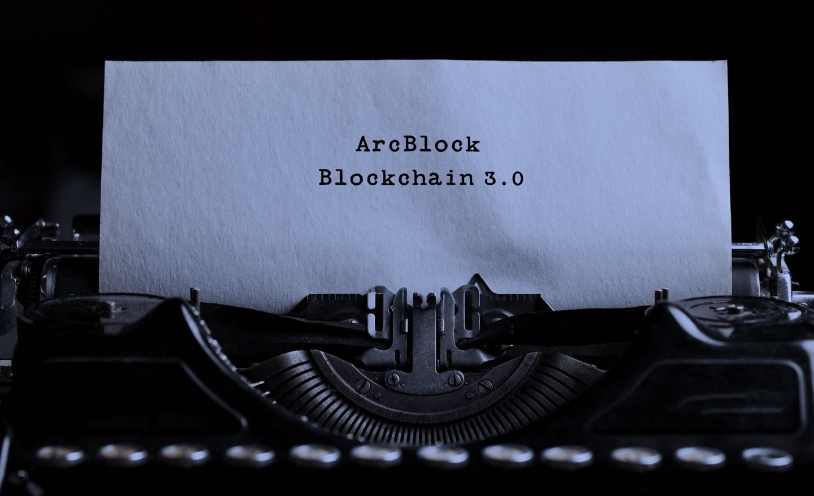

## Online Hackathon {.section .section--hero .section--image-background .section--inverted class="hackathon-hero"}

!ActionButton[Watch the Demos](https://www.youtube.com/playlist?list=PL5L00--5OObL813bdFUlZ4qE_6hRBbX35){theme="default" class="hero-btn"}

## Online Hackathon Challenge {.section .section--centered}

Join us in building products, integrations and tools for the ArcBlock ecosystem to build a better decentralized web.

**The hackathon will begin on June 20th and run for 7 days**

You can join anytime during this period.

<iframe id="arcblock-video" width="800" height="450" style="margin: 30px auto;" src="https://www.youtube.com/embed/6YfCPt5qTa8" frameborder="0" allow="accelerometer; autoplay; encrypted-media; gyroscope; picture-in-picture" allowfullscreen></iframe>

## What to Build {.section .section--left class="custom-ul-style"}

- **Hackathon**: June 20 - June 27
- **Register**: [Submit your team through the Github page](https://github.com/ArcBlock/HackathonDevCon2020/issues)
- **Demo**: On June 27th, all contestants will present their submissions during a live video conference with judges selecting the winner live.

Build your project to expand the ArcBlock ecosystem with new use cases, functionality and usability for the ABT Node. Create a new Blocklet, add functionality to an existing one, or both. Some example project are included below:

- Extending existing ArcBlock products into Blocklets
- Analytical and monitoring blocklets for ABT Node
- Enabling external tools like IPFS to run seamlessly on the ABT Node
- Games and fun blocklets

This list is not meant to be all-inclusive - we encourage projects outside of the example provided as long as they meet the requirements of the hackathon and bring value to the ArcBlock ecosystem!

**TIP:** Learn to build a DApp in less than 30-minutes.

## Prizes {.section .section--feature-list}

20,000 ABTs, rewards and prizes

#### 1st Place

- **10,000 ABT**
- 5 ArcBlock coaching sessions
- 2 VC investment coaching sessions
- Signed copy of ArcBlock book

#### 2nd Place

- **5,000 ABT**
- 2 ArcBlock coaching sessions
- 1 VC Investment coaching sessions
- Signed copy of ArcBlock book

#### 3rd Place

- **2,500 ABT**
- 1 ArcBlock coaching session
- Signed copy of ArcBlock book

#### Participants

- **100 ABT** for each participant with a runnable submission

## Eligibility {.section .section--image-feature-list}

Developers may enter one (1) submission between 9:00am PST starting June 21st, 2020 and 9:00AM PST on June 27th, 2020.

Follow steps 1, 2, 3 and join the hackathon today.

#### **View the rules**

Sign you up on [Github Hackathon Repo](https://github.com/ArcBlock/HackathonDevCon2020/issues)

#### **Join the Hackathon**

Follow the instructions on the README

#### **Submit your project**

You must submit your project through a pull request

## Requirements {.section .section--left class="custom-ul-style"}

**Only working submissions are eligible to win contest prizes**. PowerPoint or mockups won't be accepted. Project and submission requirements for the hackathon include the following:

- A repo of your project must be available on GitHub.
- Only open source code may be used in submitted projects.
- Author(s) must own 100% of the IP rights of the project and upon submission authorize ArcBlock to use their name, project and related IP to display for public relations and news activities.
- Projects must be created during the hackathon period.
- Present live demo of working submission.
- it is recommended that each team prepare a pre-recorded video as a backup for the live demo.

## Judging Criteria {.section .section--centered class="custom-ul-style custom-ul-style-no-prefix"}

Judges will pick the best submission by scoring on four criteria from 1 to 5. The four scoring categories include:

- Originality
- Creativity
- Engineering skills
- User experience

## Judges {.section .section--avatar-list .section--centered}

#### Jiaxi Lin, Founder of Guojin Capital

#### Justin Tomboulian, VP of Cap Gemini

#### Huishen Cui, Managing Director of Roaming Capital

## Hackathon Badges

ArcBlock will issue unique non-fungible token (NFT) badges during the hackathon event including 4 classes of unique badges that participants and supports can obtain.

1. **Team Badge**: Premium badges unique to team members include

- Team registration
- Have official idea or code submitted through Github page
- Must not be meaningless app or copy of existing app (decided by the judges)
- Each team member will receive 1 team badge

2. **Project Badge**: For teams who present their projects on the final day and meet the requirements below

- The project is operational
- Selected to participate in Demo Day june 27 (by the judges)
- Each team member receives 1 project badge and 100 ABT

3. **Winning Badge**: A unique NFT Badge for winning teams selected as winners

- Selected to participate in the June 27 Demo Day
- Each team member receives 1 project badge, 1 "Winner" NFT certificate, and other rewards

4. **Audience Badge (3 levels)**:

- Each Demo project gives viewers the chance to get 1 badge
- Viewers will receive basic badges
- If you already have a team badge, you'll receive an upgraded Premium badge
- For any audience member who has all the badges you will receive the highest level **Top Block** badge.

## Rules Definitions and Terms {.section .section--list class="custom-ul-style"}

The contest is open to individuals that are over the age of 18 prior to the Contest Entry Period. Residents of any country, state, province or territory where the laws of the United States or local law prohibits participating or receiving a prize in the Hackathon (including, but not limited to, Cuba, Sudan, Iran, North Korea, Syria and any other country designated by the United States Treasury's Office of Foreign Assets Control) are not eligible.

**Additional rules for hackathon participants:**

- Only original work will be accepted
- Each team can be made up of no more than 5 members
- ArcBlock employees, relatives and partners are **eligible** to participate as teams or participants
- Winning prizes will be awarded per-project
- Each project will provide an ABT Wallet address in their submission in order to receive the prize. It's up to the project owner to decide how to divide among team members.
- Each project submission should include individual team member names or a valid GitHub handles and ABT Wallet addresses during submission. Individual participation awards and badges will be sent directly to each member.
- Your participation starts only **AFTER** you have submitted and completed.
- All rewards are assigned to the user(s) who's were selected as winning projects and have been approved by ArcBlock.
- Each submission will be reviewed by an ArcBlock team member and a judge to verify that the submission is runnable.
- Issuing of ABT Tokens and winning badges, certificates will occur upon completion of the event.
- Tokens issued will be ArcBlock's native ABT Token which is a kind of utility token for ABT Networks.
