@include ../fragments/style.md

## ArcBlock DevCon 2020 {.section .section--hero .section--image-background .section--inverted}

1 场面向全球的线上开发者大会，为期 2 天、人人可参与

2020 年 6 月 20-21 日

!ActionButton[视频回放](https://www.youtube.com/watch?v=UIumgiLLxLE&list=PL5L00--5OObL7XGBvnrDBRDfFmb-RJemR){theme="default" class="get-ticket-btn"}
!ActionButton[领取新书](https://books.arcblockio.cn){theme="default" class="get-ticket-btn get-countdown-ticket"}

## 中英文 2 场大会和 1 场持续 7 天的黑客马拉松 {.section .section--centered class="home-theme home-theme-no-prefix schedule-section"}

ArcBlock DevCon 2020 将向全球视频直播，以主题演讲、教学课堂、圆桌讨论、应用演示以及网上黑客马拉松等多种形式， 探究区块链、去中心化身份和去中心化应用的未来

- **DevCon 英语场：** 6 月 19 - 20 日（太平洋标准时间）

- **DevCon 中文场：** 6 月 20 - 21 日（中国标准时间）

- **黑客松演示日：** 6 月 28 日（太平洋标准时间与中国标准时间）

<iframe id="arcblock-video" width="800" height="450" style="margin: 30px auto;"  frameborder="0" src="https://v.qq.com/txp/iframe/player.html?vid=a0979fegp16" allowFullScreen="true"></iframe>

了解我们的初心与愿景

## DevCon 日程 {.section--reversed .section--inverted .section--centered .section--left bgColor="#9e39a9" class="home-theme" id="schedule"}

### 2020 年 6 月 20 日（周六）

| **时间**  |                                   **主题**                                   |       **演讲者**       |
| :-------: | :--------------------------------------------------------------------------: | :--------------------: |
| 9:00 CST  |           [ArcBlock 平台打造记](/en/topic?id=where-we-are-today-zh)            |         冒志鸿         |
| 9:30 CST  | [DApps 开发新范式：ABT 节点](/en/topic?id=the-feature-of-arcblock-abt-node-zh) |         冒志鸿         |
| 10:30 CST |              [ABT 节点部署](/en/topic?id=abt-node-deployment-zh)               |         张镇强         |
| 11:30 CST |     [圆桌：ABT 节点与云计算](/en/topic?id=abt-node-and-cloud-computing-zh)     | 冒志鸿，刘亮为，康馨月 |
| 12:15 CST |         [Blocklet：构建去中心化应用的基石](/en/topic?id=blocklets-zh)          |         王仕军         |
| 13:15 CST |         [ABT 钱包：通往去中心化世界的钥匙](/en/topic?id=abt-wallet-zh)         |         顾学武         |
| 14:15 CST |             [去中心化身份](/en/topic?id=decentralize-identity-zh)              |          陈俊          |
| 15:15 CST |       [ArcBlock 通用浏览器](/en/topic?id=arcBlock-universal-browser-zh)        |         卢佳孟         |
| 16:15 CST |        [圆桌：区块链如何实战](/en/topic?id=how-does-blockchain-work-zh)        |   冒志鸿，方军，陈俊   |
| 17:00 CST |                                     结束                                     |                        |

### 2020 年 6 月 21 日（周日）

| **时间**  |                                               **主题**                                                |   **演讲者**   |
| :-------: | :---------------------------------------------------------------------------------------------------: | :------------: |
| 10:00 CST |                [区块链游戏：无限引力](/en/topic?id=blockchain-game-infinite-gravity-zh)                 |      荆陶      |
| 10:45 CST |         [去中心化资讯平台：梦阳快讯](/en/topic?id=blockchain-info-platform-mengyang-express-zh)         |      陈凯      |
| 11:30 CST |                [区块链食品溯源：茶链](/en/topic?id=blockchain-food-source-tea-chain-zh)                 |     徐咏忻     |
| 12:15 CST |                       [教学课堂：ABT 节点](/en/topic?id=teach-class-abt-node-zh)                        | 王仕军，张镇强 |
| 14:15 CST |              [教学课堂：去中心化身份](/en/topic?id=teach-class-decentralized-identity-zh)               |     卢佳孟     |
| 16:15 CST | [教学课堂：用 Forge SDK 构建能够运行在 ABT Node 里的区块链游戏](/en/topic?id=teach-class-blockchain-zh) | 王仕军，顾学武 |
| 18:15 CST |                            [黑客马拉松启动](/en/topic?id=hackathon-start-zh)                            |     冒志鸿     |
| 18:35 CST |                                                 结束                                                  |                |

*以上日程将根据实际情况实时进行微调，敬请留意。

## 演讲者 {.section .section--avatar-list .section--centered id="speakers"}

#### Arry Yu

[卡斯卡迪亚区块链理事会](https://www.washingtontechnology.org/blockchain/) 主席

#### Charles Chen

[美国国务院](https://www.state.gov)人工智能总监

#### 陈俊

ArcBlock 公关副总裁

#### 陈凯

新浪微博 工程师

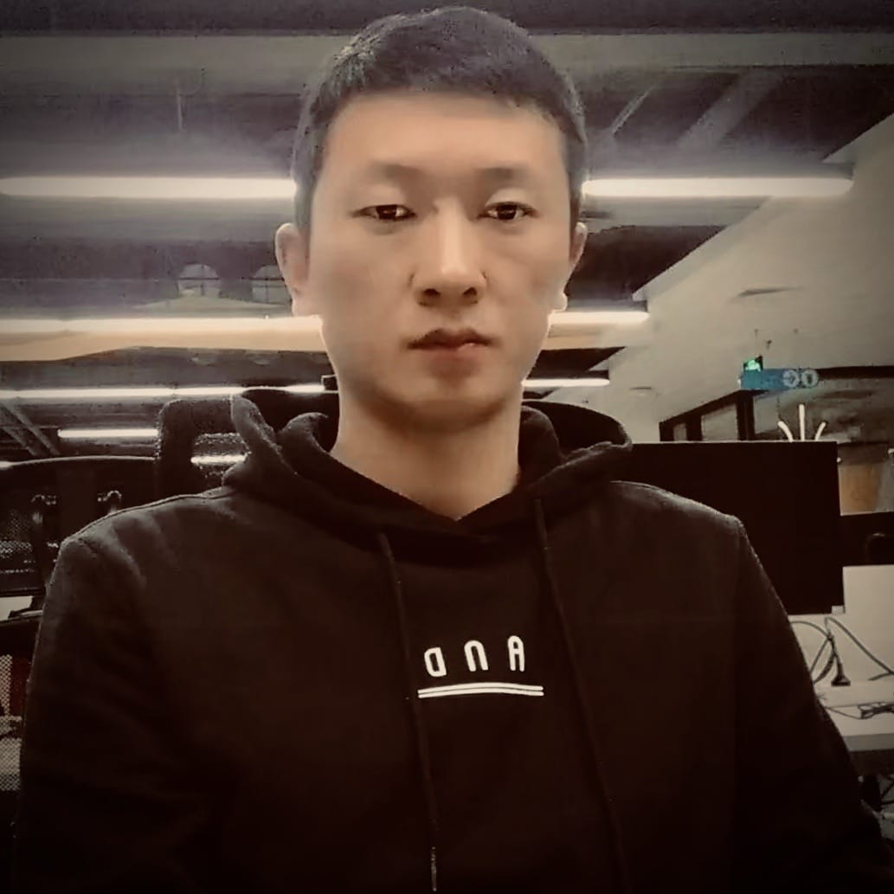

#### Chloe Tottem

云计算布道者

#### Dan Blaner

亚马逊 AWS QLDB 解决方案架构师

#### 方军

火币大学 顾问合伙人

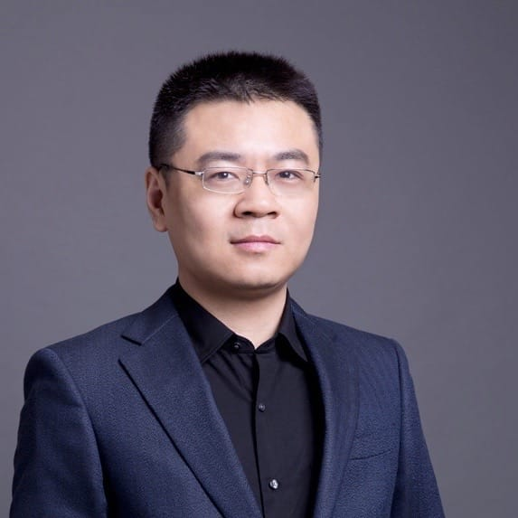

#### 顾学武

ArcBlock 工程师

#### Ian Griswold

美国华盛顿州技术行业协会 政府事务高级经理

#### 荆陶

[引力波互动](http://www.gravitywavegame.com/) 首席执行官

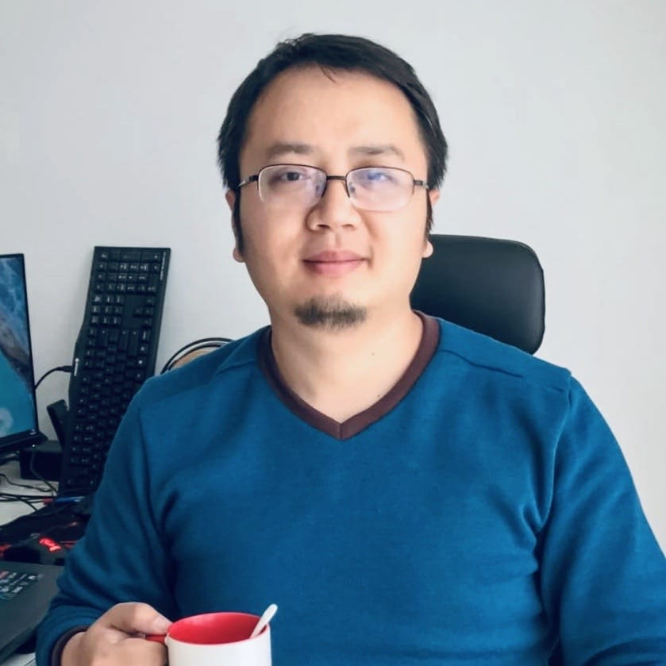

#### Justin Tomboulian

[凯捷集团](https://www.capgemini.com/) 副总裁

#### Kaliya Young

Internet Identity Workshop, [Identity Woman](https://www.identitywoman.net) 联合创始人

#### 康馨月

微软 Azure 产品市场经理

#### Kyle Ellicott

[Topio Networks](https://www.topionetworks.com) 联合创始人

#### Lana Kalashnyk

亚马逊 AWS 全球技术伙伴负责人

#### 刘亮为

[又拍云](https://www.upyun.com/) 首席执行官

#### 卢佳孟

ArcBlock 高级工程师

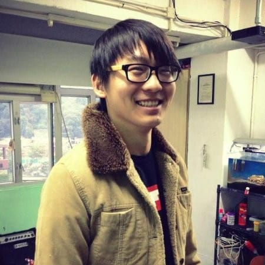

#### Matthew Czajka

[AURO Cloud](https://www.auro.io) 高级工程师

#### Matt Mckinney

ArcBlock 市场副总裁

#### 冒志鸿

ArcBlock 首席执行官

#### Samir Saluja

[DeriveOne](https://www.deriveone.com) 创始合伙人

#### Steve Albonico

波音区块链业务部门

#### Tony Chu

[Canadian Web Hosting](https://www.canadianwebhosting.com) 首席执行官

#### Tyler Boscolo

[LifeID](https://www.lifeid.io) 首席运营官

#### 王仕军

ArcBlock 高级工程师

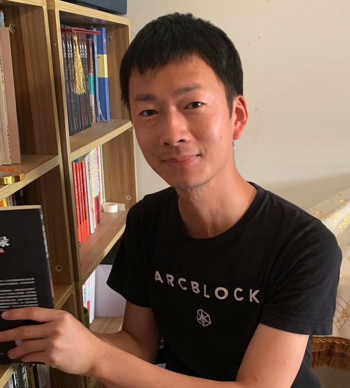

#### 徐咏忻

区块动力 工程师

#### 张镇强

ArcBlock 工程师

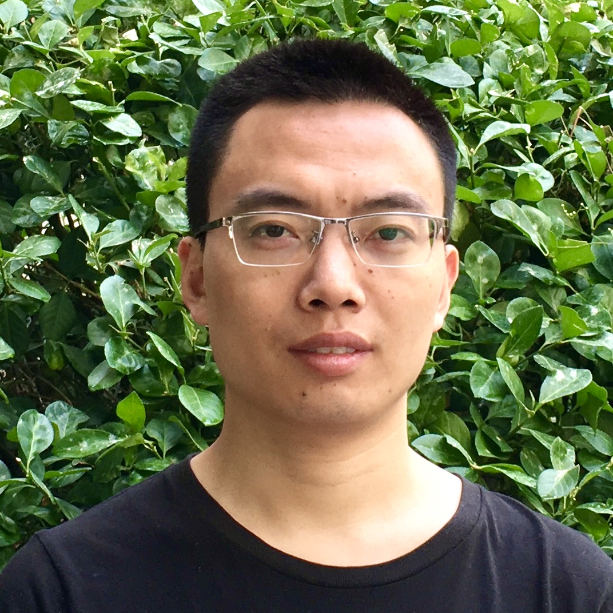

## \*以上人员按首字母排序 {class="speaker-tip"}

## 网上黑客马拉松 {.section--reversed .section--inverted .section--centered bgColor="#9e39a9"}

ArcBlock 黑客马拉松 2020 完全在网上虚拟举行，所有环节均在 7 天内完成。 
参赛者将使用 ArcBlock 平台开发自己的应用，争取奖励。

**请置身于 ArcBlock 生态的中心！** 
 

!ActionButton[了解更多](https://devcon.arcblock.io/zh/hackathon){theme="default"}

## 合作伙伴{.section .section--avatar-list .section--centered class="partner-avatar" id="partners"}

#### AWS

#### AZURE

#### AURO

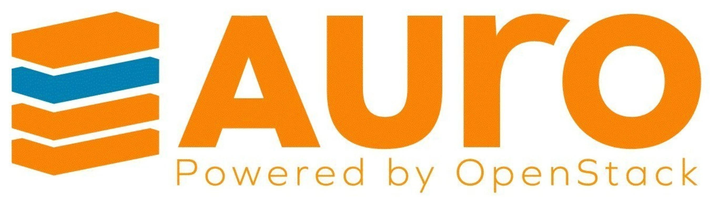

#### upyun

#### wtia

#### dif

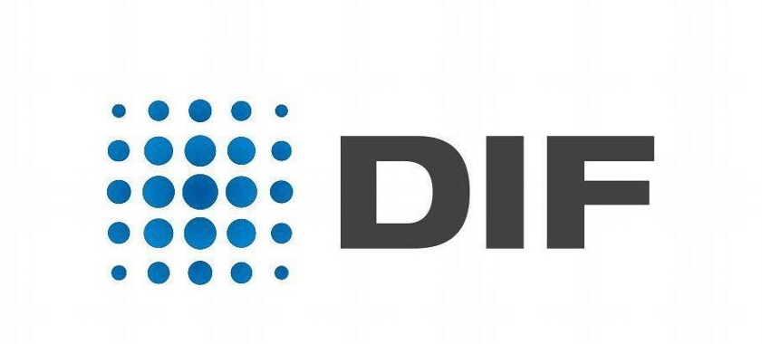

#### IIW

#### erlang

#### gofun

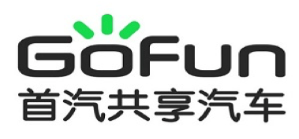

#### huatai

#### gravitywave

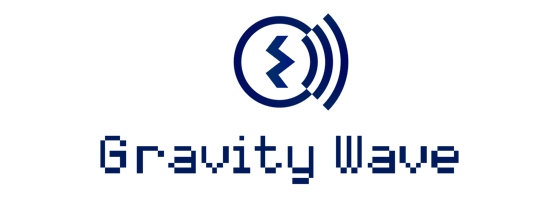

#### cybermiles

#### quarkchain

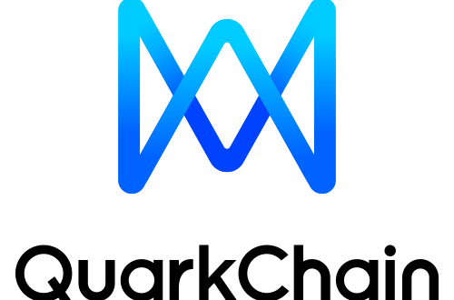

#### bloxroute

#### lifeid

#### hrtech

#### zhongxin

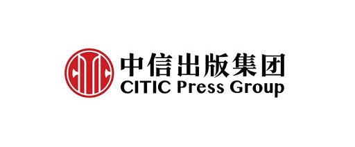

#### og

#### CSDN

#### epubit

#### chainnews

#### Odaily

#### jinse

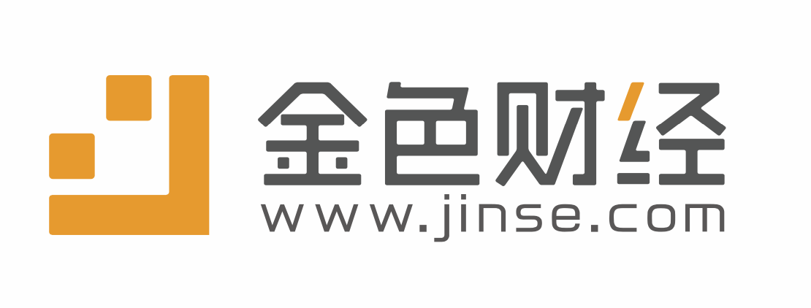

#### bihu

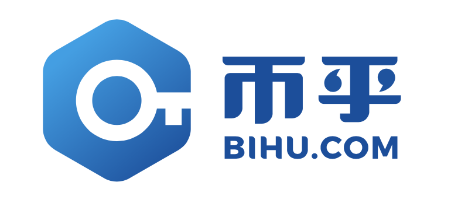

## \*排名不分先后 {class="speaker-tip partner-tip"}

## {.section}

!ContactForm{formId="f264a8ef-3354-48f1-9863-42a894602204" title="想参加比赛还是成为赞助商？即刻联络。" button="联络我们" fields="公司,电邮,姓,名" successMessage="表格提交成功"}
